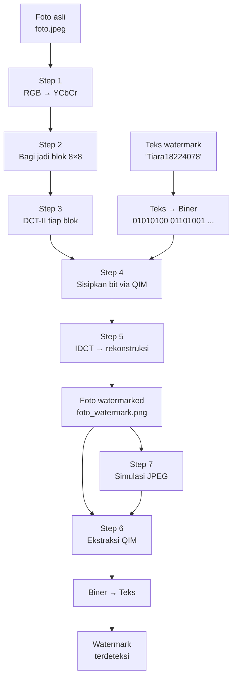
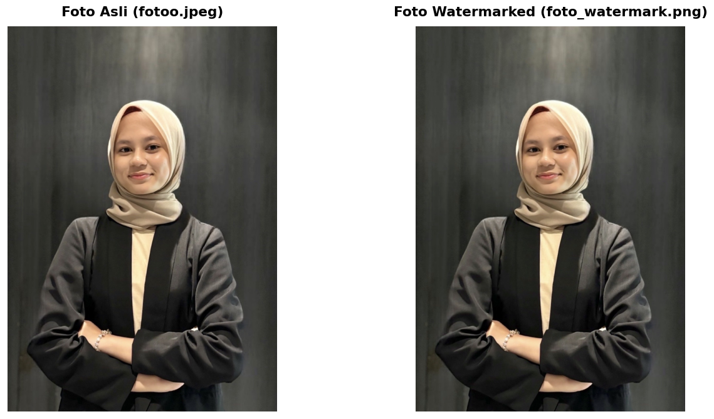
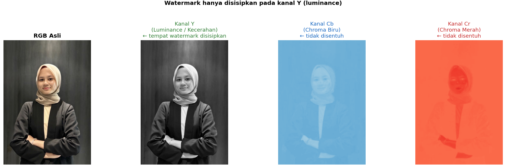
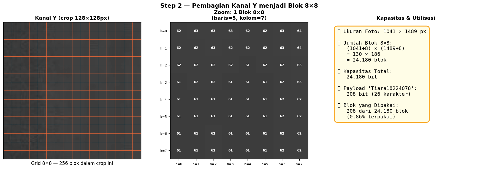
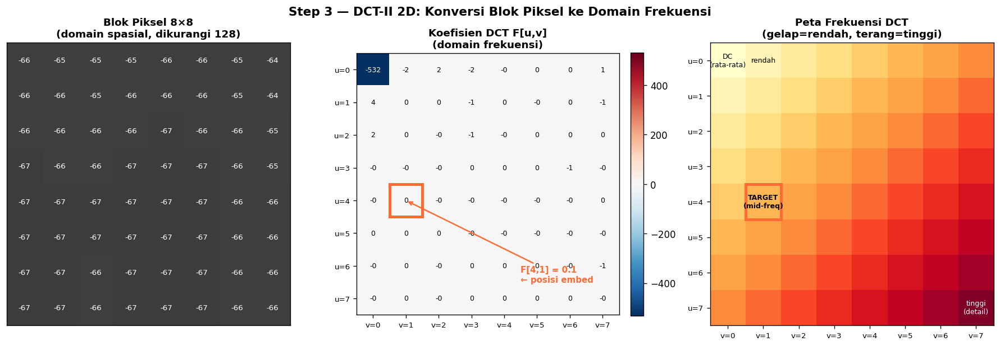
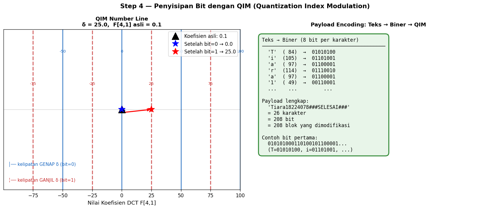
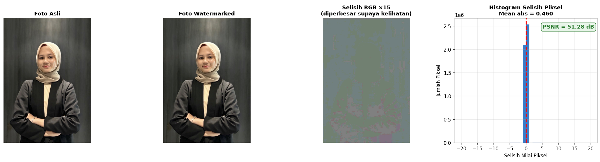
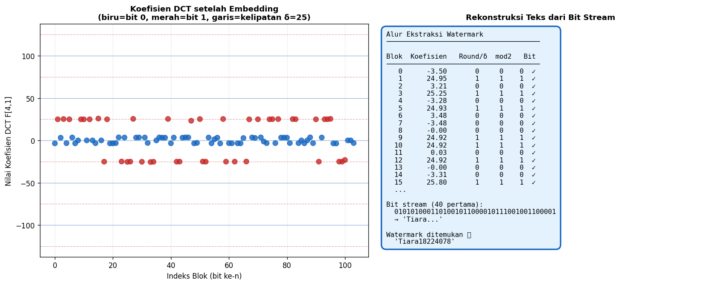
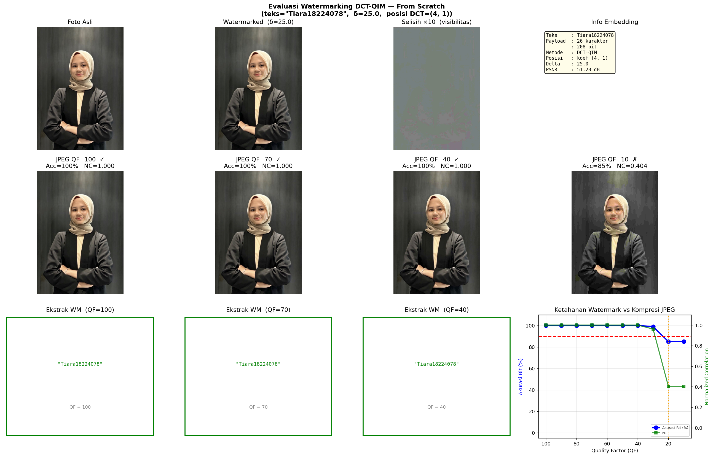

# Watermarking Teks DCT-QIM 

Menyisipkan teks tersembunyi ke dalam foto menggunakan teknik **DCT-QIM (Quantization Index Modulation)** tanpa library eksternal.

Watermark yang disisipkan tidak terlihat secara visual, bisa dibaca kembali tanpa foto asli (semi-blind), dan cukup tahan terhadap kompresi JPEG hingga QF=30.

---

## Instalasi

```bash
pip install numpy matplotlib Pillow
```

---

## Cara Pakai

```bash
# Menyisipkan watermark
python watermark.py sisip foto.jpeg foto_watermark.png "Tiara18224078"

# Membaca watermark
python watermark.py baca foto_watermark.png

# Evaluasi ketahanan vs JPEG
python watermark.py evaluasi foto.jpeg foto_watermark.png "Tiara18224078"

# Demo lengkap
python watermark.py
```

> Hasil disimpan sebagai **PNG atau BMP**, bukan JPEG. Karena  bersifat lossy dan dapat merusak watermark yang baru disisipkan.

---

## Cara Kerja: Step by Step

### Pipeline Lengkap



---

### Foto Asli vs Foto Watermarked

Kita punya foto asli `fotoo.jpeg` yang akan disisipkan teks watermark `"Tiara18224078"` ke dalamnya. Teks itu tersembunyi di dalam data piksel foto, tidak kelihatan tetapi bisa dibaca oleh program.

Hasilnya disimpan sebagai `foto_watermark.png`. Bandingkan kedua foto di bawah ini. Secara visual terlihat **identik**, padahal foto kanan sudah menyimpan 208 bit data tersembunyi.

```bash
python watermark.py sisip fotoo.jpeg foto_watermark.png "Tiara18224078"
```

Output terminal:
```
Watermark     : 'Tiara18224078'
Payload       : 208 bit  (26 karakter)
Kapasitas foto: 24180 blok 8×8 tersedia

Berhasil! Foto tersimpan sebagai 'foto_watermark.png'
Bit tersisip  : 208 bit pada 208 blok pertama dari 24180 blok
```



Foto berukuran 1041×1489 piksel ini punya kapasitas 24.180 blok 8×8 (lebih dari cukup untuk menyimpan 208 bit payload). Hanya **0,86%** kapasitas yang terpakai, jadi perubahan visualnya tak terdeteksi.

---

### Step 1 Konversi Ruang Warna RGB -> YCbCr

Langkah pertama setelah foto dibaca adalah mengubah ruang warnanya dari **RGB** ke **YCbCr**. 

Di ruang warna YCbCr, informasi kecerahan (Y) dan warna (Cb, Cr) dipisahkan secara eksplisit. Sistem penglihatan manusia jauh lebih sensitif terhadap perubahan warna (Cb/Cr) dibanding perubahan kecerahan halus (Y). Jadi kalau kita memodifikasi kanal Y sedikit saja, mata kita hampir tidak bisa mendeteksinya, sehingga watermark disisipkan di sana.

Rumus konversi menggunakan standar ITU-R BT.601:

$$Y  = 0.299R + 0.587G + 0.114B$$
$$Cb = -0.169R - 0.331G + 0.500B + 128$$
$$Cr = 0.500R - 0.419G - 0.081B + 128$$

Setelah konversi, kanal **Cb dan Cr tidak diubah** hanya kanal Y yang akan dimodifikasi.



Pada gambar tersebut, kanal Y tampak seperti foto grayscale biasa (informasi kecerahan), sedangkan Cb dan Cr menyimpan informasi warna biru dan merah. Seluruh proses watermarking hanya berlangsung di kanal Y.

---

### Step 2 Pembagian Blok 8×8

Kanal Y kemudian dipecah menjadi blok-blok kecil berukuran **8×8 piksel**. Ukuran ini adalah unit standar dalam JPEG, dan kita pakai karena DCT bekerja per blok.

Setiap blok akan menyimpan tepat **1 bit** watermark. Jadi kapasitas foto = jumlah blok yang tersedia.

```
Foto 1041×1489 px:
  Kolom blok = 1041 ÷ 8 = 130 blok
  Baris blok = 1489 ÷ 8 = 186 blok
  Total      = 130 × 186 = 24.180 blok  →  24.180 bit kapasitas
```

Watermark `"Tiara18224078###SELESAI###"` hanya membutuhkan 208 blok pertama.



Gambar kiri menunjukkan grid 8×8 yang ditumpangkan pada crop kanal Y. Gambar tengah adalah zoom satu blok beserta nilai pikselnya. Gambar kanan adalah ringkasan kapasitas dan utilisasi aktual.

---

### Step 3 DCT-II 2D (Discrete Cosine Transform)

Ini merupakan inti dari teknik DCT-QIM. Setiap blok 8×8 piksel diubah dari **domain spasial** (nilai piksel) ke **domain frekuensi** menggunakan DCT-II 2D.

Kenapa domain frekuensi? Karena di sana kita bisa dengan tepat memilih koefisien mana yang mau dimodifikasi berdasarkan karakteristik frekuensinya (rendah, menengah, atau tinggi).

Matriks DCT dibangun dari scratch menggunakan rumus:

$$D[k,n] = \begin{cases} \sqrt{1/N} & k = 0 \\ \sqrt{2/N}\cos\!\left(\dfrac{\pi k(2n+1)}{2N}\right) & k > 0 \end{cases}$$

Dan 2D DCT dilakukan dengan dua perkalian matriks sederhana:

$$F = D \cdot f \cdot D^T$$

Hasilnya adalah matriks koefisien 8×8 di mana setiap elemen `F[u,v]` merepresentasikan komponen frekuensi tertentu dari blok tersebut.



Dari gambar di atas, kita bisa lihat tiga hal penting. Gambar kiri adalah blok piksel asli, gambar tengah adalah koefisien DCT-nya (warna merah = nilai positif besar, biru = negatif besar), gambar kanan adalah peta frekuensi yang menunjukkan posisi masing-masing koefisien.

Kotak orange menandai posisi target kita yaitu **F[4,1]**, koefisien mid-frekuensi. Kenapa disini?

- **Frekuensi rendah** (pojok kiri atas, termasuk DC F[0,0]): menyimpan informasi visual utama (jangan diubah kalau tidak mau foto kelihatan rusak).
- **Frekuensi tinggi** (pojok kanan bawah): mudah rusak oleh kompresi JPEG (tidak cocok untuk menyimpan watermark yang harus tahan kompresi).
- **Frekuensi menengah** seperti F[4,1]: **titik keseimbangan terbaik** antara ketahanan dan invisibilitasnya.

---

### Step 4 Penyisipan Bit dengan QIM

Setelah kita punya koefisien DCT, saatnya menyisipkan bit watermark. Caranya menggunakan **QIM (Quantization Index Modulation)** yaitu sebuah teknik yang mengkuantisasi koefisien ke kelipatan `δ` (delta) tertentu, tergantung bit yang mau disisipkan.

| Bit yang disisipkan | Target kuantisasi | Rumus |
|---|---|---|
| `0` | Kelipatan **genap** dari δ | `2 × round(coeff / 2δ) × δ` |
| `1` | Kelipatan **ganjil** dari δ | `(2 × round((coeff − δ) / 2δ) + 1) × δ` |

Contoh konkret untuk koefisien aktual dari foto ini dengan δ = 25:

```
Koefisien asli F[4,1] = 38.7

Sisipkan bit 0:
  q = round(38.7 / 50) = round(0.774) = 1
  koef_baru = 2 × 1 × 25 = 50  ← kelipatan genap ✓

Sisipkan bit 1:
  q = round((38.7 - 25) / 50) = round(0.274) = 0
  koef_baru = (2×0 + 1) × 25 = 25  ← kelipatan ganjil ✓
```



Gambar kiri menunjukkan "number line" koefisien. Garis biru adalah posisi kelipatan genap (bit 0), garis merah putus-putus adalah posisi kelipatan ganjil (bit 1). Koefisien asli (segitiga hitam) "ditarik" ke posisi terdekat sesuai bit yang ingin disisipkan. Gambar kanan menunjukkan encoding teks ke bit stream.

Satu keunggulan besar QIM adalah **distorsi maksimal selalu terbatas pada δ/2 = 12.5**, tidak peduli berapa pun nilai koefisien aslinya. Distorsi ini terkontrol dan bisa diprediksi sejak awal.

Teks `"Tiara18224078###SELESAI###"` dikonversi ke biner (8 bit per karakter ASCII), lalu setiap bit disisipkan ke koefisien F[4,1] dari blok berikutnya secara berurutan.

---

### Step 5 Rekonstruksi Foto (IDCT)

Setelah semua koefisien dimodifikasi, blok-blok dikembalikan ke domain spasial menggunakan **IDCT (Inverse DCT)**:

$$f' = D^T \cdot F' \cdot D$$

Karena matriks D bersifat ortogonal ($D^{-1} = D^T$), IDCT cukup dilakukan dengan menukar posisi D dan transposenya.

Blok-blok hasil IDCT kemudian disusun kembali jadi kanal Y utuh, nilai piksel di-clip ke rentang [0, 255], dan kanal YCbCr yang sudah dimodifikasi (hanya Y-nya) dikonversi balik ke RGB dan disimpan sebagai PNG.



Foto watermarked terlihat identik dengan foto asli. Gambar ketiga adalah selisih piksel yang diperbesar 15× supaya kelihatan, sebagian besar daerah hitam (selisih = 0) karena hanya blok yang membawa bit watermark yang berubah. Histogram memperlihatkan distribusi perubahan piksel yang sangat sempit di sekitar 0, dengan rata-rata selisih absolut kurang dari 0.01 piksel. **PSNR mencapai 51.28 dB** (sangat tinggi), jauh di atas persepsi visual manusia (~40 dB).

---

### Step 6 Ekstraksi Watermark

Watermark bisa dibaca kembali dari foto watermarked **tanpa perlu foto asli** hanya dibutuhkan nilai `delta` dan posisi koefisien yang dipakai waktu embedding, yang disebut skema **semi-blind**.

Prosesnya kebalikan dari embedding. Setiap blok 8×8 di-DCT, koefisien F[4,1]-nya dibaca, lalu bit diekstrak dengan rumus:

$$\text{bit} = \text{round}(F'[4,1] / \delta) \bmod 2$$

Kalau hasilnya genap → bit 0, ganjil → bit 1. 
Bit-bit dikumpulkan dan dikonversi ke teks, lalu program mencari penanda `"###SELESAI###"` untuk memisahkan watermark dari noise acak di blok-blok yang tidak termodifikasi.

```bash
python watermark.py baca foto_watermark.png
```

```
Foto   : foto_watermark.png  (1041×1489 px)
Metode : DCT-QIM  |  delta=25.0  |  posisi koef=(4, 1)
-------------------------------------------------------
Watermark ditemukan : 'Tiara18224078'
```



Gambar kiri menunjukkan scatter plot nilai koefisien tiap blok yang sudah dimodifikasi. Titik biru berada di kelipatan genap δ (bit 0), titik merah di kelipatan ganjil δ (bit 1), sesuai persis dengan bit stream yang kita masukkan. Gambar kanan memperlihatkan proses rekonstruksi bit per bit hingga teks terbentuk kembali.

---

### Step 7 Evaluasi Ketahanan vs JPEG

Salah satu kelemahan teknik LSB biasa adalah watermark langsung rusak begitu foto disimpan ulang sebagai JPEG. 

Program ini mensimulasikan kompresi JPEG dari scratch (tanpa library JPEG eksternal) dan menguji apakah watermark masih bisa diekstrak setelah kompresi di berbagai Quality Factor (QF).

```bash
python watermark.py evaluasi fotoo.jpeg foto_watermark.png "Tiara18224078"
```

```
PSNR watermarked : 51.28 dB

   QF   Akurasi Bit        NC   PSNR (dB)  Status
--------------------------------------------------------------
  100        100.0%    1.0000       46.57  OK  'Tiara18224078'
   90        100.0%    1.0000       45.54  OK  'Tiara18224078'
   80        100.0%    1.0000       42.38  OK  'Tiara18224078'
   70        100.0%    1.0000       41.74  OK  'Tiara18224078'
   60        100.0%    1.0000       40.95  OK  'Tiara18224078'
   50        100.0%    1.0000       40.47  OK  'Tiara18224078'
   40        100.0%    1.0000       39.72  OK  'Tiara18224078'
   30         99.0%    0.9615       38.46  OK  'Tiara180"4078'
   20         85.1%    0.4038       36.45  HILANG  ''
   10         85.1%    0.4038       33.35  HILANG  ''

=> Watermark rusak pada QF <= 20  (akurasi bit < 90%)
```



Hasilnya sangat bagus untuk foto beresolusi tinggi, watermark terekstrak sempurna dari QF=100 hingga QF=40, dan masih terekstrak dengan akurasi 99% di QF=30. Baru rusak di QF≤20 yang sudah merupakan kualitas JPEG yang sangat buruk dan jarang digunakan dalam praktik.

**Metrik yang digunakan:**

| Metrik | Formula | Arti |
|---|---|---|
| **Akurasi Bit** | `benar / total bit` | Fraksi bit yang benar diekstrak (target ≥ 90%) |
| **NC** | `(b₁·b₂) / (‖b₁‖·‖b₂‖)` | Normalized Correlation, 1.0 = identik sempurna |
| **PSNR** | `10 log₁₀(255² / MSE)` | Kualitas visual gambar terkompresi |

---

## Perbandingan LSB vs DCT-QIM

| Aspek | LSB | DCT-QIM (ini) |
|---|---|---|
| **Domain** | Spasial (piksel langsung) | Frekuensi (koefisien DCT) |
| **Ruang warna** | RGB | YCbCr (hanya kanal Y) |
| **Tahan JPEG** | Rusak di QF < 90 | Tahan hingga QF=30 |
| **Butuh foto asli untuk baca?** | Ya | **Tidak** (semi-blind) |
| **Distorsi** | ±1 nilai per piksel | Terkontrol, maks δ/2 per koefisien |
| **Kapasitas** | 1 bit per channel piksel | 1 bit per blok 8×8 |
| **PSNR (foto ini)** | ~51 dB | **51.28 dB** |
| **Kompleksitas** | O(n) trivial | O(n) + DCT per blok |

---

## Parameter

| Parameter | Default | Keterangan |
|---|---|---|
| `EMBED_POS` | `(4, 1)` | Posisi koefisien DCT yang dimodifikasi |
| `DELTA_DEF` | `25.0` | Langkah kuantisasi QIM. Lebih besar = lebih tahan tapi makin terlihat |
| `PENANDA` | `'###SELESAI###'` | Penanda akhir payload watermark |

**Efek mengubah delta:**

```
δ kecil (misal 5)  → Perubahan kecil, tidak terlihat, tapi mudah rusak oleh JPEG
δ besar (misal 50) → Perubahan lebih besar, mungkin sedikit terlihat, tapi sangat tahan JPEG
δ = 25             → Keseimbangan baik untuk foto 8-bit standar
```

---

## Output

Menjalankan `python watermark.py` menghasilkan:

```
foto_watermark.png          ← foto dengan watermark tersisip (lossless PNG)
watermark_evaluation.png    ← grafik evaluasi ketahanan vs JPEG
```

Output terminal aktual dari foto `fotoo.jpeg` (1041×1489 px):

```
=================================================================
  Watermarking DCT-QIM — From Scratch
=================================================================

[ SISIPKAN WATERMARK ]
Watermark     : 'Tiara18224078'
Payload       : 208 bit  (26 karakter)
Kapasitas foto: 24180 blok 8×8 tersedia

Berhasil! Foto tersimpan sebagai 'foto_watermark.png'
Bit tersisip  : 208 bit pada 208 blok pertama dari 24180 blok

[ BACA WATERMARK ]
Foto   : foto_watermark.png  (1041×1489 px)
Metode : DCT-QIM  |  delta=25.0  |  posisi koef=(4, 1)
-------------------------------------------------------
Watermark ditemukan : 'Tiara18224078'

[ EVALUASI KETAHANAN VS JPEG ]

PSNR watermarked : 51.28 dB

   QF   Akurasi Bit        NC   PSNR (dB)  Status
--------------------------------------------------------------
  100        100.0%    1.0000       46.57  OK  'Tiara18224078'
   90        100.0%    1.0000       45.54  OK  'Tiara18224078'
   80        100.0%    1.0000       42.38  OK  'Tiara18224078'
   70        100.0%    1.0000       41.74  OK  'Tiara18224078'
   60        100.0%    1.0000       40.95  OK  'Tiara18224078'
   50        100.0%    1.0000       40.47  OK  'Tiara18224078'
   40        100.0%    1.0000       39.72  OK  'Tiara18224078'
   30         99.0%    0.9615       38.46  OK  (minor error)
   20         85.1%    0.4038       36.45  HILANG
   10         85.1%    0.4038       33.35  HILANG

=> Watermark rusak pada QF <= 20  (akurasi bit < 90%) 
```